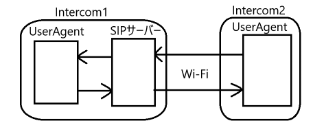
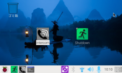
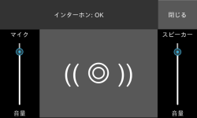
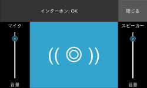

# インターホン（ラズパイ２台接続）

急に家の２部屋間で連絡を取りたくてインターホンが欲しくなった。 
スマホでＯＫなんだけど、ちょっとした会話には充分過ぎる。
また、スマホが普及しているからだろうけど、市販のインターホンは少なくなっているようだ。 
そこで、余っているラズパイを使ってみました。

##  構成

* ２部屋間を繋ぐだけなのでそれぞれに１台ずつ設置し、Wi-Fiで接続
* 通話ボタンをタッチするだけで相手と会話が始まり、ふたたびタッチすると切断
* 保留やその他の通話機能は無し
* 片方のラズパイには、SIPサーバー機能も兼用

### ハードウェア構成

* ラズパイ2台: Raspberry Pi 4B with タッチディスプレイ
* USBスピーカーフォン2台: [audio-technica AT-CSP1](https://www.audio-technica.co.jp/product/AT-CSP1)

### ソフトウェア構成

* OS: [Raspberry Pi OS (64bit) with desktop](https://www.raspberrypi.com/software/operating-systems/)
* Python用GUIキット: [Kivy 2.3.1](https://kivy.org/) 
* SIPサーバーソフト: [Asterisk version22.2.0](https://www.asterisk.org/) （FreePBXにしたかったけど、ラズパイに非対応だった）
* SIPライブラリィ: [pjsip version2.15.1](https://www.pjsip.org/)のPJSUA2ライブラリィ

> 他に開発環境として、[Raspberry Pi connect (Beta)](https://www.raspberrypi.com/software/connect/)とVSCodeを使用

## 使い方

|項目|操作|
|---|---|
|発信|通話ボタンを押すと、会話が始まる。|
|受信|勝手に会話が始まる。|
|切断|会話中に通話ボタンを押すと切断する。|

> マイクとスピーカーの音量調整もできる。
---

# 導入

## それぞれのRaspberry Piの構成と設定

|項目|Intercom1|Intercom2|
|---|---|---|
|Raspberry Pi|Raspberry Pi 4B|Raspberry Pi 4B|
|タッチディスプレイ|[WAVESHARE 18645](https://www.waveshare.com/4.3inch-dsi-lcd-with-case.htm)|[MPI4008](https://github.com/goodtft/LCD-show)|
|スピーカーフォン|[audio-technica AT-CSP1](https://www.audio-technica.co.jp/product/AT-CSP1)|[audio-technica AT-CSP1](https://www.audio-technica.co.jp/product/AT-CSP1)|
|OS|Raspberry Pi OS(64bit) with desktop|Raspberry Pi OS(64bit) with desktop|
|Wi-Fi|有効|有効|
|IPアドレス|(固定)|(固定)|
|ホスト名|intercom1|intercom2|
|ユーザー名|voice|voice|
|パスワード|********|********|
|SIPサーバー|[Asterisk version22.2.0](https://www.asterisk.org/)|-|
|SIPライブラリィ|[pjsip version2.15.1](https://www.pjsip.org/)|[pjsip version2.15.1](https://www.pjsip.org/)|
|SIP name|intercom1|intercom2|
|SIP idUri|sip:intercom1@intercom1|sip:intercom2@intercom1|
|SIP registrarUri|sip:intercom1|sip:intercom1|
|SIP password|unsecurepassword|unsecurepassword|
> **SIP password** は例です、ちゃんと自分で考えましょう。

## ダウンロード

~~~sh
git clone --depth 1 https://github.com/tomosatoP/intercom.git
~~~

ついでに次のファイルを再配置する。
|filename|コピー先フォルダ|補足|
|---|---|---|
|intercom.png|~/.icons|$ mkdir ~/.icons|
|intercom.desktop|~/.local/share/applications||
|intercom.sh|~/intercom|コピーしなくて良いけど、実行権限を付与 $ chmod 755 (filename)|
> **~/intercom** にインストールした場合

## SIPサーバーソフト[Asterisk version22.2.0](https://www.asterisk.org/)の導入

[INSTALL_ASTERISK](INSTALL_ASTERISK.md) 

* Intercom1のみ実施

参考 https://docs.asterisk.org/Getting-Started/Beginning-Asterisk/

## SIPライブラリィ[pjsip version2.15.1](https://www.pjsip.org/)の導入

[INSTALL_PJSUA2](INSTALL_PJSUA2.md)

* Intercom1, Intercom2の両者で実施
* 合わせて **Python用仮想環境venv** と **Python用GUIキット[kivy](https://kivy.org/)** も導入

参考 https://docs.pjsip.org/en/latest/pjsua2/intro.html
